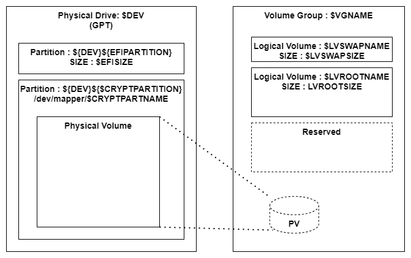
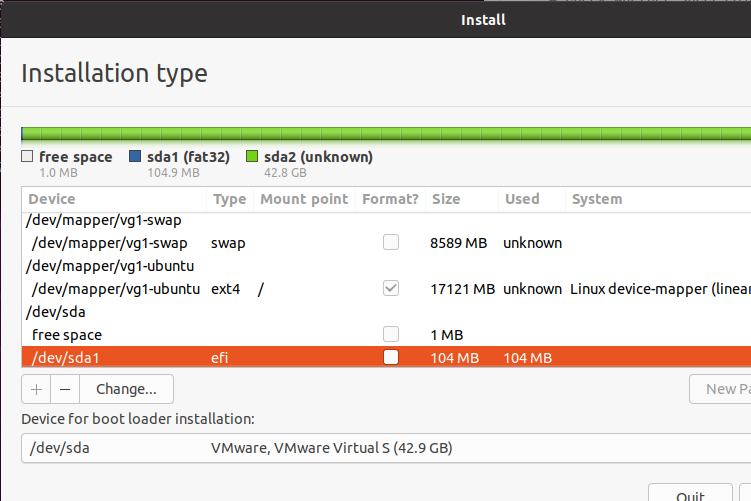

# Ubuntu 20.04LTS installation into the LVM on the LUKS volume. 

This is a script corrections to help the installation of Ubuntu with the full disc encryption. 
These scripts are designed to achieve followings :
- Using Ubiquity installer, for the ease of install.
- Install to the UEFI firmware system.
- Install Ubuntu to the LVM/LUKS volume.
- /boot is installed in to the same volume with /. Thus, grub is also encrypted. 
- The swap volume is created inside encrypted volume. 
- Support multi-boot installation. You can reserve certain encrypted volume space for the other distribution. 

By the configuration parameters, you can achieve these script to relatively wide configuration. 
For example, you can configure the system to accept 2, 3 or 4 distribution in a HDD/SSD, as you want. 

Following is the HDD/SSD partitioning plan of these script. 



While the EFI partition is depicted here, that is not needed if you install to the system with BIOS.
This can be controllable from a parameter. Also, the size of the Linux / volume is 
configurable from a parameter. 

The volume group has only one physical volume. 

# Test environment
These scripts are tested with following environment. 
- VMWare Workstation 15.5 ( EFI )
- Ubuntu 20.04.2 amd64 desktop
- Ubuntu Mate 20.04.2 amd64 desktop

# Preparation
This script is designed to use by copy-and-past to the shell (bash) window. 
So, it is strongly recommended to prepare the net work connection, and show this 
page and the shell window side-by-side 
If it is impossible, you may want to copy these scripts into a USB memory 
and jack into your machine, during the installation, to allow the copy-and-paste. 

# Installation
Follow the steps below. 

## Preparation of shell window
First of all, promote the shell to root. Almost of the procedure requires root privilege. 
```bash
# Promote to the root user
sudo -i
```
## Input Passphrase
Input the passphrase to lock your crypt system. This passphrase is required to type when GRUB starts. 
The passphrase is recorded as an environment variable to refuge the type multiple time without error. 
```bash
# Setup the passphrase of the crypt partition
read -sr PASSPHRASE
```
## Configuration parameters
This is a set of parameter for the configuration of : 
- Destroy all partition on a /dev/sda.
- Create an 100MB EFI partition in /dev/sda1.
- Rest of the disk space is assigned to the LUKS volume in dev/sda2.
- The EFI and LUKS partition are /dev/sda1 and /dev/sda2, respectively.
- Create and logical volume group named "vg1" in the encrypted volume. 
- Create a swap volume named "swap" in the "vg1". The size is 8GB.
- Create a volume named "ubuntu" for / in the "vg1". The size of the 50% of the entire free space.

If you don't like above configuration, you can modify the following parameter before pasting to the shell window.

If you set the EFIPARTITION to 0, the EFI partition is not created. 
If you set the SWAPSIZE is "0", the swap volume is not created. 
```bash
# export to share with entire script
export PASSPHRASE

# Device and partition setting. If you wan to MAKE /dev/sda2 as linux root partition,
# set the DEV and CRYPTPARTITION to /dev/sda and 2, respectively.
# EFI partition is usually fixed as partition 1. If you set 0, Script will skip to make it. 
export DEV="/dev/sda"

# If you set to "0", EFI partition will no be made.
export EFISIZE="100M"

# You may want to change the LVROOT for your installation
export CRYPTPARTNAME="luks_volume"
export VGNAME="vg1"
export LVSWAP="swap"
export LVROOT="ubuntu"

# If you set "0" to SWAPSIZE, the script skips to create the swap volume.
# This is useful if you add a distribution to the system which has swap volume already.
export SWAPSIZE="8G"

# The ROOTSIZE is percentage to the free space in the volume group. 
# 50% mean, new partition will use 50% of the free space in the LVM volume group. 
export ROOTSIZE="50%FREE"

# Do not touch following lines. 
if [  $EFISIZE != "0" -a $EFISIZE != "0M"  ] ; then 
export EFIPARTITION=1
export CRYPTPARTITION=2
else
export CRYPTPARTITION=1
fi
```
## Format the disk and encrypt the LUKS partition
C A U T I O N : Following script destroys all the data in your disk. Make sure you want to destroy all. 

If you want to add a new distribution to the existing distribution, following script block must be skipped. 

```bash
# Optional : Create partitions for in the physical disk. 
# Assign specified space and rest of disk to the EFI and LUKS partition, respectively.
sgdisk --zap-all "${DEV}"
if [  $EFISIZE != "0" -a $EFISIZE != "0M"  ] ; then 
sgdisk --new=${EFIPARTITION}:0:+${EFISIZE} --change-name=${EFIPARTITION}:"EFI System"  --typecode=${EFIPARTITION}:ef00 "${DEV}"  
mkfs.vfat -F 32 -n EFI-SP "${DEV}${EFIPARTITION}"
fi
sgdisk --new=${CRYPTPARTITION}:0:0    --change-name=${CRYPTPARTITION}:"Linux LUKS" --typecode=${CRYPTPARTITION}:8309 "${DEV}"

sgdisk --print "${DEV}"

# Encrypt the partition to install the linux
printf %s "${PASSPHRASE}" | cryptsetup luksFormat --type=luks1 --key-file - --batch-mode "${DEV}${CRYPTPARTITION}"
```
## Open the LUKS partition
You have to opened the LUKS partition here for the subsequent tasks. To open it, the script asks you type the passphrase.

For the first distribution to install, I recommend you to type the passphrase to open the partition, because
you might create the partition and encrypted it this time. The encryption was done with your passphrase you set to the
PASSPHRASE variable. So, this is the last chance whether you set the passphrase correctly or not. 
```bash
# Open the created crypt partition. To be sure, input the passphrase manually
cryptsetup open  "${DEV}${CRYPTPARTITION}" ${CRYPTPARTNAME}
```
For the second, third, ... distribution to install, I recommend you to feed the passphrase from PASSPHRASE 
variable automatically. The partition was encrypted in past. So, the this is the chance to check whether 
the passphrase in the PASSPHRASE variable is correct or not.
```bash
# Open the created crypt partition. To be sure, input the passphrase manually
printf %s "${PASSPHRASE}" | cryptsetup open -d - "${DEV}${CRYPTPARTITION}" ${CRYPTPARTNAME}
```
If everything is done successfully, you will see the LUKS volume under /dev/mapper
```bash
# Check whether successful open. If mapped, it is successful. 
ls -l /dev/mapper
```
## Configure the LVM in LUKS volume
The swap volume and / volume is created here, based on the given parameters. 
```bash
# Create the Physical Volume and Volume Group. 
pvcreate /dev/mapper/${CRYPTPARTNAME}
vgcreate ${VGNAME} /dev/mapper/${CRYPTPARTNAME}

# Optional : Create a SWAP Logical Volume on VG, if volume size is not 0.
if [ ${SWAPSIZE} != "0"  -a  ${SWAPSIZE} != "0G" ] ; then lvcreate -L ${SWAPSIZE} -n ${LVSWAP} ${VGNAME} ; fi

# Create the ROOT Logical Volume on VG. 
lvcreate -l ${ROOTSIZE} -n ${LVROOT} ${VGNAME}
```
## Run the Ubiquity installer 
Open the Ubiquity installer, configure and run it. Ensure you map the followings correctly ( The host volume name in this example is based on the default values of the configuration parameters. Map the right volumes based on your configuration parameters)
Host Volume            | Target Directory
-----------------------|-----------------
/dev/sda1              | /boot/efi
/dev/mapper/vg1-ubuntu | /

C A U T I O N : If the installer start the file copying, execute next script quickly before the installation finishes. 



## Configure the target GRUB during the Ubiquity runs
Run the following script on the shell window, during the Ubiquity runs. Otherwise, Ubiquity fails at the end of installation. 

C A U T I O N : Do not reboot at the end of Ubiquity installation. Click "continue". 
If you reboot at here, system will ask you the passphrase twice.
```bash
# Make target GRUB aware to the crypt partition
echo "GRUB_ENABLE_CRYPTODISK=y" >> /target/etc/default/grub
```


## Mount the targets
After Ubiquity finish the installation, mount the target directories and chroot to that.
```bash
# Mount the volume and change root
# /target is created by the Ubiquity installer
mount /dev/mapper/${VGNAME}-${LVROOT} /target
for n in proc sys dev etc/resolv.conf; do mount --rbind "/$n" "/target/$n"; done
chroot /target /bin/bash
```
## Click continue
As noted above, do not reboot. Click "Continue to test". 


## Add auto decryption to the target kernel
Now, we are at critical phase. To avoid system asks passphrase twice, we have to embed the key inside ramfs initial image. 
This image with key is stored in the LUKS volume, so, it is stored in the safe storage. 
GRUB decrypt this LUKS volume, upload the ramfs image to the RAM, and pass it to the booted Linux kernel. 
```bash
# Mount the rest of partitions by target /etc/fstab
mount -a

# Set up the kernel hook of encryption
apt install -y cryptsetup-initramfs
echo "KEYFILE_PATTERN=/etc/luks/*.keyfile" >> /etc/cryptsetup-initramfs/conf-hook
echo "UMASK=0077" >> /etc/initramfs-tools/initramfs.conf

# Prepare a key file to embed in to the ramfs.
mkdir /etc/luks
dd if=/dev/urandom of=/etc/luks/boot_os.keyfile bs=4096 count=1
chmod u=rx,go-rwx /etc/luks
chmod u=r,go-rwx /etc/luks/boot_os.keyfile

# Add a key to the key file. Use the passphrase in the environment variable. 
printf %s "${PASSPHRASE}" | cryptsetup luksAddKey -d - "${DEV}${CRYPTPARTITION}" /etc/luks/boot_os.keyfile

# Add the LUKS volume information to /etc/crypttab to decrypt by kernel.  
echo "${CRYPTPARTNAME} UUID=$(blkid -s UUID -o value ${DEV}${CRYPTPARTITION}) /etc/luks/boot_os.keyfile luks,discard" >> /etc/crypttab

# Finally, update the ramfs initial image with the key file. 
update-initramfs -uk all
```
## Finishing installation
Done!!

You can reboot. Linux and GRUB are installed in a encrypted storage. The system will ask you the passphrase only once when GRUB starts. 
```bash
exit
reboot
```

# Acknowledgments
These scripts are based on the script shared on the [myn's diary](https://myn.hatenablog.jp/entry/install-ubuntu-focal-with-lvm-on-luks). That page contains rich information, hint and techniques around the encrypted volume and Ubiquity installer. 